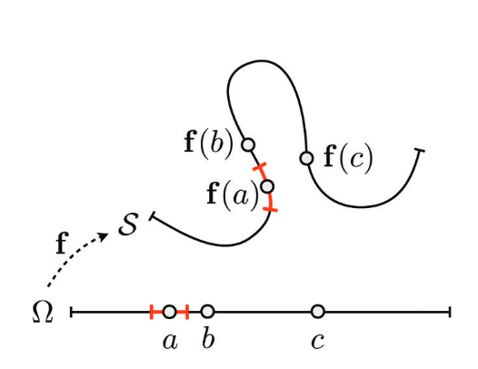

# Surface Representation
## Surface Definition and Properties
计算机图形学中所谓表面（surface），其定义即是：*一个嵌在三维空间中的二位有向连续流形*。

但是实际上大多数计算机图形学中能获取到的物体表面的数据都是离散的（类似点云），因此对于计算机图形学中表面表示的第一步，就是定义其连续性。

在隐式表达中*测地线（geodesic）*的邻接关系（即空间网格关系）是很难表达出来的，但是在参数化表达中却比较容易：

> 图中可以看出在 $\mathbb{R}^2$ 的平面空间中，曲线上有三点 $f(a),f(b),f(c)$ ，实际上对于一根曲线（维度为 $\mathbb{R}$ ），仅有 $f(a),f(b)$ 是相邻的，也如下面参数坐标 $\Omega$ 所示，但是在 $\mathbb{R}^2$ 的平面上，这三点都是相邻的。

因此对于**局部流形**的定义可以由此产生：在 $\mathbb{R}^3$ 空间中，对于参数化流形表面（ $\mathbb{R}^2$ ）上的一点 $p$ ，如果点 $q$ 位于其在空间中，以一个足够小的 $\delta$ 作为半径的球内，那么 $q$ 等价于是在 $p$ 参数化空间 $\Omega\;(\mathbb{R}^2)$ 的一个足够小 $\delta$ 的圆内。

最后要定义一个曲面有**多光滑**，在数学上是用连续性 $C^k$ 来定义的，因此一般来讲曲面的一阶导数不能为 $0$ ，否则连续性没意义。

## Approximation Power
一般来讲我们都是使用多项式对于真实几何物体表面做*拟合*的，之所以能使用**多项式**，是因为有一个名叫*Weierstrass定理*的理论做支撑的，也即：对于任意光滑的函数（曲面也可以被视作是一个函数），都可以以任意**精度**被一个多项式拟合。

提到精度，还有一个理论：一个 $C^{\infty}$ 的函数 $g$ ，如果他导数的值大小有限，则在区间大小为 $h$ 的区间内，可以用一个次数为 $p$ 的多项式，以 $O(h^{p+1})$ 的误差进行拟合（类似于泰勒级数的皮亚诺余项）。 

由此产生了**两种**减小误差的方法：缩小区间 $h$ ，或者增大多项式次数 $p$ 。

## Parametric Surface Representations（参数化表达）
曲面参数化可以用这个函数来表示： $f:\Omega\mapsto S$ ，也即用一个 $\mathbb{R}^2$ 的二维参数化空间来表示三维中的信息，那么许多三维问题，例如在曲面上采样，就可以被转化为一个二维问题，此外，如果将参数化函数与曲面的**形变**方程 $d:\mathbb{R}^3\mapsto\mathbb{R}^3$ 相结合，那么**曲面形变**计算将会变得更加高效。

但另一方面，曲面的参数化也是十分复杂的，因为我们必须找到一个与 $S$ 在**拓扑**和**度量**上都相似的参数化空间 $\Omega$ ，而且一旦曲面发生改变，参数化空间 $\Omega$ 也必须改变，比如说一些三维建模软件，我们更希望直观的对着三维空间中的曲面 $S$ 做一些类似于捏橡皮泥一样的操作，这样才做那些三维艺术家比较友好，但是想要把这些操作反映在参数化空间 $\Omega$ 上（比如说保持较低的三角形扭曲），却是十分困难的。

此外因为参数化定义的曲面是有函数 $f:\Omega\mapsto S$ 来定义的，这也就意味着 $\Omega$ 和 $S$ 有着相同的拓扑结构，所以一旦改变三维空间曲面 $S$ 的拓扑， $\Omega$ 的拓扑也必须跟着改变，但是拓扑结构的改变操作对于参数化表示是十分复杂的。此外参数化表示的平面因为其区间是 $\Omega$ 这样一个二维空间，那么许多三维空间中的属性，例如空间相对于曲面的**内外**，或者三维空间中曲面的自我碰撞的判断，这些都是很难检测或是计算的。

因此参数化曲面的弱点很明显就是**拓扑改变**与**空间查询**

### Spline Surface
张量积样条曲面，又称NURBS，是一个在CAD系统中的标准曲面表示方法，如果说一个NURBS曲面的连续性为 $C^n$ ，那么他在 $U$ 和 $V$ 两个方向的结点向量分别为： $\{u_0,\cdots,u_{m+n+1}\},{v_0,\cdots,v_{k+n+1}}$ ，其中 $m$ 和 $k$ 为控制点的最大下标（控制点个数为 $m+1$ 和 $k+1$ ），那么NURBS曲面的参数定义空间为：

$$\begin{aligned}f:[u_{n+1},u_{m+1}]\times[v_{n+1},v_{k+1}] &\rightarrow \mathbb{R}^3 \\\\ (u,v) &\mapsto \sum_{i=0}^m\sum_{j=0}^k\boldsymbol{c_{ij}}N_i^{n+1}(u)N_j^{n+1}(v)\end{aligned}$$

NURBS曲面正如他的定义域一样，总是能表示一块嵌在 $\mathbb{R}^3$ 空间中的长方形，因此如果想要表达空间中的复杂曲面，必须使用非常多块NURBS曲面拼接起来才能表示，这也就是所谓的拓扑约束，且为了保持全局的连续性（不仅仅是在**一块**NURBS曲面内部），还必须要有块与块之间的额外约束条件才行，这样也会导致计算变得十分复杂。

最后NURBS曲面的另一个缺点就是细化十分困难，其实就是说如果要在原来的控制点的基础上增加更多的控制点，那么新的控制点的结点只能插入到原先的结点向量中间，导致整个NURBS曲面发生变化。

### Triangle Meshes
由 $[\boldsymbol{a},\boldsymbol{b}, \boldsymbol{c}]$ 三个顶点组成的三角形，其内部的任意一个点 $p$ 都可以通过重心坐标公式表达：

$$\boldsymbol{p}=\alpha\boldsymbol{a}+\beta\boldsymbol{b}+\gamma\boldsymbol{c}$$

其中

$$\alpha+\beta+\gamma=1\; \; \alpha,\beta,\gamma \ge 0$$

因此我们可以定义一个将参数化平面上三角形 $[\boldsymbol{u,v,w}]$ 内某一个点映射带三维空间中三角形 $[\boldsymbol{a,b,c}]$ 内某一个的线性变换方程：

$$f:\alpha \boldsymbol{u}+ \beta \boldsymbol{v} + \gamma \boldsymbol{w} \mapsto \alpha \boldsymbol{a} + \beta \boldsymbol{b}+\gamma \boldsymbol{c}$$ 

因此对于嵌入在三维空间 $\mathbb{R}^3$ 中的二维三角形网格**面**，我们可以用一系列的点来表示：

$$\mathcal{P}=\{\boldsymbol{p}_1, \cdots, \boldsymbol{p}_{\mathcal{V}}\},\; \; p_i:=p(v_i)=\begin{pmatrix}x(v_i) \\\\ y_(v_i) \\\\ z(v_i) \end{pmatrix}$$

其中，顶点 $v_i\in \mathcal{V}$ ，顶点的位置为 $\boldsymbol{p}_i$

此外，根据上文（Approximation Power）可知，任何一个三角形网格面的误差为 $O(h^2)$ ，其中 $h$ 是三角形网格的边长，而因为三角形网格面是用重心坐标**线性**表示的，也就是一次函数，因此次数 $p=1$ ，误差大小为 $O(h^2)$ 。也就是说，如果我们使用将三角形网格的边的长度减少至一半的细分方法的话，三角形网格的误差将减少至原来的 $\frac{1}{4}$ ，当然同时面的数量也会增值4杯。

一般来讲，我们考虑的三角形网格都是**2维流形**，对于这样的网格，我们可以利用*欧拉公式*来描述其点( $V$ )、边( $E$ )、面( $F$ )的数量关系：

$$V-E+F=2(1-g)$$

其中 $g$ 是一个网格面的*亏格*，形象的理解就是网格上*洞*的数量，虽然这是不准确的。

对于大部分应用场景来讲，*亏格*的数量比起点、边、面的数量实在是小的可怜，因此对于等式右边我们可以近似看为0，那么对于一个是**2维流形**的三角形网格，我们会有：

$$\begin{aligned}3F&=V \\\\ 2E&=V \\\\ F&=2E \end{aligned}$$

因此会有这样一个统计上的近似：

$$\begin{aligned}F&\approx 2V \\\\ E&\approx 3V \\\\  Degree(V)&\approx 6\end{aligned}$$

其中， $Degree$ 表示一个点的**度**。

## Implicit Surface Representation（隐式表达）
所谓*隐式*表达曲面，就是通过将整个其所嵌入的空间归类为位于模型表面的*里*和*外*两种情况的表达方式。

无论是用哪种隐式表达方式，模型曲面一定是被定义为值为 $0$ 的地方，也因此无论哪种形式的隐式表达，都可以用空间中的连续标量场 $\mathcal{F}$ 来表达。

不过因为隐式表达是通过将空间划分为*里*和*外*两种情况的表达方式，所以模型表面一定不会产生**自交**。

### Regular Grids
因为要在计算机中处理隐式函数表达的曲面，我们必须对空间进行离散，最简单的离散方式就是将空间**均匀**的切分为足够密的小格子，对于需要计算的值，我们可以通过三线性插值（也就是分别对 $xyz$ 三个方向依次进行插值计算，类比于双线性插值），不过这个将会消耗大量内存。

### Adaptive Data Structure
为了更好的内存使用效率，必须对数据结构进行改进。

因为我们只关心空间中存在模型曲面的地方，因此只需要对于模型曲面附近的空间经行精细的划分，以提供足够计算隐式函数正负的精度。因此一个带有**层级结构**的**八叉树**位为首选。

对于存在于曲面*里*或*外*的空间进行计算并不会提高模型曲面本身的精度，因此，我们会适应性的对于那些与模型表面有相交的空间（正方体小网格）进行精细化处理，而且为了简便计算，这些小网格的体积大小是一样的，只需要保证他们足够小就行了。顺着这个方法，我们将划分好的空间用颜色进行标记，即*白色（外）*，*黑色（里）*以及*灰色（存在曲面的空间）*，那么就能得到这个方法的名称——**三色八叉树**。

这个方法还能进一步改进，在对*灰色*的空间进行划分时，我们进一步增强限制，这次不仅仅是**存在**曲面就行了，我们还对数值精度有要求，即只有那些在对空间标量场进行三线性插值计算后值为0左右，且仅与真实值相差了一个很小的**容忍度（tolerance）**的空间才划分进*灰色*部分。

## Conversion Methods
为了能充分利用**隐式表达**与**参数化表达**两者的优势，我们最好能有一个在**隐式表达**与**参数化表达**之间转化的方法。

不过因为在计算机的实际计算中，两种表达方式都是离散化的（参数化表达中的Triangle Meshes，隐式表达中的Adaptive Grids），所以在转化过程中，两者都会经历一个重采样（resampling）的过程，也就是离散数值连续化。

### Parametric to Implicit（参数化 $\rightarrow$ 隐式）
一般是通过计算空间网格（Grid）所在的点 $\boldsymbol{g}$ 与其距离最近的曲面上的点 $\boldsymbol{c}$ 之间的向量与 $\boldsymbol{c}$ 点的法线的内积，即：

$$\boldsymbol{(g-c)}^T\boldsymbol{n(c)}<0$$

来将参数化转化为隐式表达的。

### Implicit to Parametric（隐式 $\rightarrow$ 参数化）
