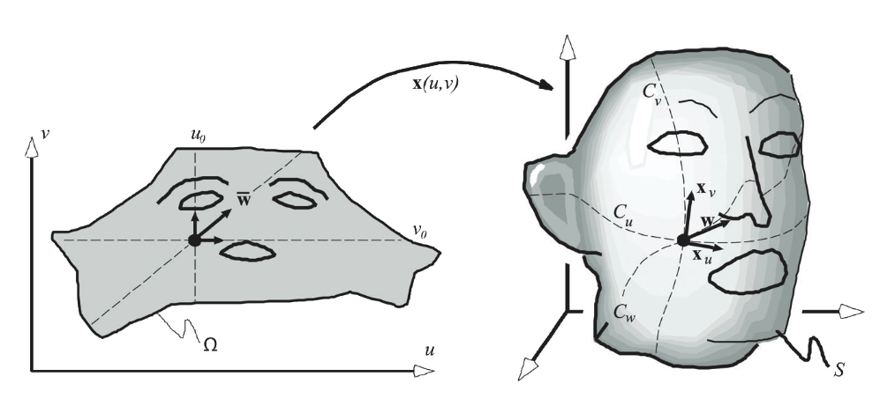

# Differential Geometry
## Curves
在一个二维平面上（ $\mathbb{R}^2$ ），一条曲线实际上就是一个1维流形，因此曲线可以被写为：

$$\boldsymbol{X}(u)=(x(u),y(u))^T$$

因此曲线的切线方向也可以被很容易写出：

$$\boldsymbol{x}^{'}(u)=(x^{'}(u),y^{'}(u))^T$$

其法线方程可以视为切线方程旋转 $90^\circ$ 的结果，至于是顺时针还是逆时针，视具体情况而定。

$$\boldsymbol{n}(u)=\frac{\boldsymbol{x}^{'}(u)^\bot}{||\boldsymbol{x}^{'}(u)^\bot||} $$

### Arc Length
曲线弧长的计算为其切线大小的积分：

$$s=s(u)=\int_a^u||x^{'}(t)||dt$$

其实这个公式背后还隐藏了一个思想，即参数化曲线在某一点的导数大小，不仅仅能表示某一点的“速度”大小，也能反映曲线在某一点被“拉伸”的幅度。

### Curvature
曲率是一个标量，其表示的是曲线在某一点，与其切线方向偏离幅度的“度量”，的表达式为：

$$\kappa(s)=||x^{''}(s)||$$

注意这里的变量是 $s$ ，也就是这是对曲线**某一点**的二阶导数，而不是对参数 $t$ 的，当然也可以改写为：

$$\begin{aligned}\kappa(s)=||x^{''}(s(t))||&=||\frac{d^2x}{ds^2}|| \\\\ &=||\frac{d\frac{dx}{ds}}{ds}|| \\\\ &=||\frac{dT}{ds}|| \\\\ &= ||\frac{\frac{dT}{dt}}{\frac{ds}{dt}}|| \\\\ &= \frac{||\frac{dT}{dt}||}{||\frac{ds}{dt}||}\end{aligned}$$

其中 $T$ 为曲线在点 $s$ 处切线方向的单位向量。

此外还可以用Osculating Circle来计算曲率，基本思想就是为了计算点 $u$ 处的曲率，我们取曲线上与 $u$ 临近的两点 $u_{-}$ 和 $u_{+}$ ，我们知道三点可以确定一个圆的方程，也就能够得到这个圆的半径 $R$ ，我们假设圆的方程可以写成这样：

$$c(u,u_{-},u_{+})$$

那么Osculating Circle的定义就是让 $u_{-}$ 和 $u_{+}$ 不断向着点 $u$ 移动从而逼近，直到最后我们获得的圆 $c(u,u_{-},u_{+})$ 会在 $u$ 点与曲线相切，此时这个圆半径 $R$ 的倒数就是曲率 $\kappa(u)$ 。

$$c=\lim_{u_{-},u_{+}\rightarrow u}c(u,u_{-},u_{+})$$

$$\kappa(u) = \frac{1}{R(c)}$$

最后曲率与曲线二阶导数的转换公式为：

$$x^{''}(s)=\kappa(s)\boldsymbol{n}(s)$$

还是一样，二阶导数的方向取决于法线方向的选取。

## Surfaces

### Metric Properties
曲面 $\mathcal{S} \subset \mathbb{R}^3$ 的参数化定义是定义在一个二维平面的子空间中的，即：

$$\boldsymbol{x}(u,v)=\begin{pmatrix}x(u,v) \\\\ y(u,v) \\\\ z(u,v)\end{pmatrix}, \quad (u,v)\in\Omega\subset\mathbb{R}^2$$

其中 $\boldsymbol{x}(u,v)$ 代表了嵌入在三维空间中曲面上的一点。

和曲线一样，我们可以通过对参数求偏导得到曲面的切线：

$$\boldsymbol{x}_u:=\frac{\partial \boldsymbol{x}}{\partial u}(u_0,v_0) \quad 和 \quad \boldsymbol{x}_v:=\frac{\partial \boldsymbol{x}}{\partial v}(u_0,v_0)$$

这里的切线向量，是对于参数曲线 $C_u$ 和 $C_v$ 而言的，毕竟三维空间中对于一个曲面的切线方向可以有无数个。

而三维空间中参数曲线可以这样定义：

$$\boldsymbol{C}_u(t)=\boldsymbol{x}(u_0+t,v_0)$$

$$\boldsymbol{C}_v(t)=\boldsymbol{x}(u_0,v_0+t)$$

其中 $t$ 为**曲线**的参数，而非 $(u,v)$

虽然三维空间中曲面的切线方向有无数个，但是法向量只会有一个（虽然法向量相对于曲面向里还是向外也是人为决定的），法方向为：

$$\boldsymbol{n}=\frac{\boldsymbol{x}_u\times\boldsymbol{x}_v}{||\boldsymbol{x}_u\times\boldsymbol{x}_v||}$$

既然三维空间中的曲面切向量有无数个，那么如何定义某一个我们想要的切向量呢？我们依然先从参数空间 $\Omega\subset\mathbb{R}^2$ 入手，假定在 $u=(u_0,v_0)$ 点处的某一个方向为 $\boldsymbol{\bar{w}}$ ，则沿着这个直线映射到三维空间中的曲线为：

$$\boldsymbol{C_w}(t)=\boldsymbol{x}(u_0+tu_{\bar{w}},v_0+tv_{\bar{w}})$$

我们定义在该曲线 $t=0$ 处的切线，为方向 $\boldsymbol{w}$ 上的切向量，其中 $\boldsymbol{w}$ 为  $\boldsymbol{\bar{w}}$ 映射到三维空间中的方向： 

$$\boldsymbol{w}=\frac{\partial \boldsymbol{C_w}(t)}{\partial t}$$

换句话说，我们竟然得到了一个将参数空间中任意方向 $\boldsymbol{\bar{w}}$ 转化到三维空间 $\mathbb{R}^3$ 的映射方法，而这个映射函数可以写成一个矩阵 $\mathcal{J}$ ：

$$\mathcal{J}=\begin{bmatrix} \frac{\partial x}{\partial u} & \frac{\partial x}{\partial v} \\\\  \frac{\partial y}{\partial u} & \frac{\partial y}{\partial v} \\\\  \frac{\partial z}{\partial u} & \frac{\partial z}{\partial v}\end{bmatrix} = \begin{bmatrix}\boldsymbol{x_u} & \boldsymbol{x_v}\end{bmatrix}$$

这就是雅可比矩阵

#### 第一基本型
有了雅可比矩阵，我们就可以度量三维空间中任意两个方向之间的夹角了：

$$\boldsymbol{w_1^Tw_2}=\boldsymbol{(\mathcal{J}\bar{w_1})^T(\mathcal{J}\bar{w_2})}=\boldsymbol{\bar{w_1}^T(\mathcal{J}^T\mathcal{J})\bar{w_2}}$$

其中 $\mathcal{J}^T\mathcal{J}$ 就被称为**第一标准型**：

$$\boldsymbol{I}=\mathcal{J}^T\mathcal{J}=\begin{bmatrix}E & F \\\\ F & G\end{bmatrix}$$

而又因为任意方向导数大小为 $||\boldsymbol{w}||^2=\boldsymbol{\bar{w}^TI\bar{w}}$ ，导数又可以代表曲线的伸缩幅度，由此可以度量任意三维空间中的曲线：
