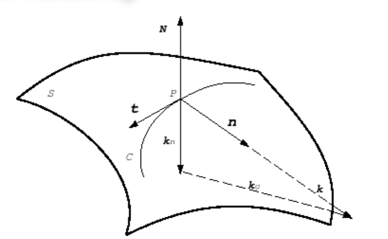

# Differential Geometry
## Curves
在一个二维平面上（ $\mathbb{R}^2$ ），一条曲线实际上就是一个1维流形，因此曲线可以被写为：

$$\boldsymbol{X}(u)=(x(u),y(u))^T \tag{1.1}$$

因此曲线的切线方向也可以被很容易写出：

$$\boldsymbol{X}^{'}(u)=(x^{'}(u),y^{'}(u))^T \tag{1.2}$$

其法线方程可以视为切线方程旋转 $90^\circ$ 的结果，至于是顺时针还是逆时针，视具体情况而定。

$$\boldsymbol{n}(u)=\frac{\boldsymbol{X}^{'}(u)^\bot}{||\boldsymbol{X}^{'}(u)^\bot||} \tag{1.3}$$

### Arc Length
曲线弧长的计算为其切线大小的积分：

$$s=s(u)=\int_a^u||x^{'}(t)||dt \tag{1.4}$$

其实这个公式背后还隐藏了一个思想，即参数化曲线在某一点的导数大小，不仅仅能表示某一点的“速度”大小，也能反映曲线在某一点被“拉伸”的幅度。

### Curvature
曲率是一个标量，其表示的是曲线在某一点，与其切线方向偏离幅度的“度量”，的表达式为：

$$\kappa(s)=||x^{''}(s)|| \tag{1.5}$$

注意这里的变量是 $s$ ，也就是这是对曲线**某一点**的二阶导数，而不是对参数 $t$ 的，当然也可以改写为：

$$\begin{aligned}\kappa(s)=||x^{''}(s(t))||&=||\frac{d^2x}{ds^2}|| \\\\ &=||\frac{d\frac{dx}{ds}}{ds}|| \\\\ &=||\frac{dT}{ds}|| \\\\ &= ||\frac{\frac{dT}{dt}}{\frac{ds}{dt}}|| \\\\ &= \frac{||\frac{dT}{dt}||}{||\frac{ds}{dt}||}\end{aligned} \tag{1.6}$$

其中 $T$ 为曲线在点 $s$ 处切线方向的单位向量。

此外还可以用Osculating Circle来计算曲率，基本思想就是为了计算点 $u$ 处的曲率，我们取曲线上与 $u$ 临近的两点 $u_{-}$ 和 $u_{+}$ ，我们知道三点可以确定一个圆的方程，也就能够得到这个圆的半径 $R$ ，我们假设圆的方程可以写成这样：

$$c(u,u_{-},u_{+}) \tag{1.7}$$

那么Osculating Circle的定义就是让 $u_{-}$ 和 $u_{+}$ 不断向着点 $u$ 移动从而逼近，直到最后我们获得的圆 $c(u,u_{-},u_{+})$ 会在 $u$ 点与曲线相切，此时这个圆半径 $R$ 的倒数就是曲率 $\kappa(u)$ 。

$$c=\lim_{u_{-},u_{+}\rightarrow u}c(u,u_{-},u_{+}) \tag{1.8}$$

$$\kappa(u) = \frac{1}{R(c)} \tag{1.9}$$

最后曲率与曲线二阶导数的转换公式为：

$$x^{''}(s)=\kappa(s)\boldsymbol{n}(s) \tag{1.10}$$

还是一样，二阶导数的方向取决于法线方向的选取。

## Surfaces

### Metric Properties
曲面 $\mathcal{S} \subset \mathbb{R}^3$ 的参数化定义是定义在一个二维平面的子空间中的，即：

$$\boldsymbol{X}(u,v)=\begin{pmatrix}x(u,v) \\\\ y(u,v) \\\\ z(u,v)\end{pmatrix}, \quad (u,v)\in\Omega\subset\mathbb{R}^2 \tag{2.1}$$

其中 $\boldsymbol{X}(u,v)$ 就是将参数空间 $\Omega$ 转换至三维空间的方程。

为了研究三维空间曲线，我们同样就需要去研究它的切线方向。求切线的思路就是对于曲线的表达式求导，那么既然 $\boldsymbol{X}$ 拥有 $(u,v)$ 两个变量，那么就是分别对这两个变量求偏导：

$$\boldsymbol{X}_u:=\frac{\partial \boldsymbol{X}}{\partial u}(u_0,v_0) \quad 和 \quad \boldsymbol{X}_v:=\frac{\partial \boldsymbol{X}}{\partial v}(u_0,v_0)  \tag{2.2}$$

现在我们沿着参数曲面的 $u,v$ 两个方向定义两条直线（如下图左侧虚线所示）， $C_u$ 和 $C_v$ 就是这两条互相垂直的直线经过 $\boldsymbol{X}(u,v)$ 映射过后的结果（如下图右侧所示），但是我们知道曲线的参数实际上只需要一个变量就行了，因为曲线虽然嵌入在二维甚至三维空间中，但它本质只是一条一维的线，那么我们就可以这样表达 $C_u$ 和 $C_v$ 这两条曲线：

$$\boldsymbol{C}_u(t)=\boldsymbol{X}(u_0+t,v_0)  \tag{2.3}$$

$$\boldsymbol{C}_v(t)=\boldsymbol{X}(u_0,v_0+t)  \tag{2.4}$$

有了两个在一点相互垂直的曲线，那么我们自然就可以通过对它们的切线做叉乘得出法向量：

$$\boldsymbol{n}=\frac{\boldsymbol{X}_u\times\boldsymbol{X}_v}{||\boldsymbol{X}_u\times\boldsymbol{X}_v||}  \tag{2.5}$$

我们刚刚研究完了沿着参数空间 $u,v$ 两个坐标轴方向的曲线的切线与它们的曲线方程，那么如何定义**任意**一个我们想要的切向量呢？我们依然先从参数空间 $\Omega\subset\mathbb{R}^2$ 的**直线**入手，假定在 $u=(u_0,v_0)$ 点处的某一个方向为 $\boldsymbol{\bar{w}}$ （上图左边斜向虚线），则这个虚线的方程为：

$$\boldsymbol{u}(t)=\begin{pmatrix}u_0+tu_{\boldsymbol{{\bar{w}}}} \\\\ v_0+tv_{\boldsymbol{{\bar{w}}}}\end{pmatrix}  \tag{2.6}$$

如果将这个直线映射到三维空间中去，那么我们只需要利用参数化方程 $\boldsymbol{X}$ ，将曲线上每一点都映射到三维空间中去就行了，数学表达为：

$$\boldsymbol{C_w}(t)=\boldsymbol{X}(\boldsymbol{u}(t))  \tag{2.7}$$

$C_{\boldsymbol{w}}$ 中的 $\boldsymbol{w}$ 没了一横是因为其代表 $\boldsymbol{\bar{w}}$ 映射到三维空间的结果。

现在，我们再从三维空间中的曲面出发，我们定义三维空间中，一条曲线的参数方程为 $C(t)$ （曲线的参数仅需要一个 $t$ 就足以表达了），那么其在 $t$ 时刻切线方向为其对 $t$ 的导数： 

$$\boldsymbol{w}=\frac{\partial \boldsymbol{C}(t)}{\partial t}  \tag{2.8}$$

那么如果说这条曲线 $\boldsymbol{C}(t)$ 就是我们刚刚在参数空间中的那条由 $\boldsymbol{\bar{w}}$ 所确定的直线，则我们可以直接将 $\boldsymbol{C}_{\boldsymbol{w}}(t)=\boldsymbol{X}(\boldsymbol{u}(t))$ 带入方程中去了。

$$\boldsymbol{w}=\frac{\partial \boldsymbol{C_w}(t)}{\partial t}=\begin{bmatrix}\frac{\partial \boldsymbol{X}}{\partial u}\frac{\partial u}{\partial t} & \frac{\partial \boldsymbol{X}}{\partial v}\frac{\partial v}{\partial t}\end{bmatrix}=\begin{bmatrix} \frac{\partial x}{\partial u} & \frac{\partial x}{\partial v} \\\\  \frac{\partial y}{\partial u} & \frac{\partial y}{\partial v} \\\\  \frac{\partial z}{\partial u} & \frac{\partial z}{\partial v}\end{bmatrix}\begin{bmatrix}\frac{\partial u}{\partial t} \\\\ \frac{\partial v}{\partial t}\end{bmatrix}=\begin{bmatrix}\boldsymbol{x_u} & \boldsymbol{x_v}\end{bmatrix}\begin{bmatrix} u_{\boldsymbol{\bar{w}}} \\\\ v_{\boldsymbol{\bar{w}}} \end{bmatrix}=\mathcal{J}\boldsymbol{\bar{w}}  \tag{2.9}$$

此处标注有些混乱， 其中粗体的 $\boldsymbol{X}$ 表示了参数化映射方程，其值在 $xyz$ 三个方向上都有各自的分量。

现在，我们竟然得到了一个将参数空间中任意方向 $\boldsymbol{\bar{w}}$ 转化到三维空间 $\mathbb{R}^3$ 的映射方法，而这个映射函数可以写成一个矩阵 $\mathcal{J}$ ：

$$\mathcal{J}=\begin{bmatrix} \frac{\partial x}{\partial u} & \frac{\partial x}{\partial v} \\\\  \frac{\partial y}{\partial u} & \frac{\partial y}{\partial v} \\\\  \frac{\partial z}{\partial u} & \frac{\partial z}{\partial v}\end{bmatrix} = \begin{bmatrix}\boldsymbol{x_u} & \boldsymbol{x_v}\end{bmatrix}  \tag{2.10}$$

这就是雅可比矩阵。

#### 第一基本型
有了雅可比矩阵，我们就可以度量三维空间中任意两个方向之间的夹角了：

$$\boldsymbol{w_1^Tw_2}=\boldsymbol{(\mathcal{J}\bar{w_1})^T(\mathcal{J}\bar{w_2})}=\boldsymbol{\bar{w_1}^T(\mathcal{J}^T\mathcal{J})\bar{w_2}}  \tag{2.11}$$

其中 $\mathcal{J}^T\mathcal{J}$ 就被称为**第一标准型**：

$$\boldsymbol{I}=\mathcal{J}^T\mathcal{J}=\begin{bmatrix}E & F \\\\ F & G\end{bmatrix}=\begin{bmatrix}\boldsymbol{X}_u^T\boldsymbol{X}_u & \boldsymbol{X}_u^T\boldsymbol{X}_v \\\\ \boldsymbol{X}_u^T\boldsymbol{X}_v & \boldsymbol{X}_v^T\boldsymbol{X}_v \end{bmatrix} \tag{2.12}$$

因此，我们就可以利用这个方法计算**曲面** $\mathcal{S}$ 上任意任意切向量的大小：

$$||\boldsymbol{w}||^2=\boldsymbol{\bar{w}^TI\bar{w}}  \tag{2.13}$$

正如我们将参数空间中的沿着 $\boldsymbol{\bar{w}}$ 方向的一条直线映射为三维空间中的一条曲线（方程2.7），我们可以不局限于直线，实际上参数化空间中的任意一条曲线 $\boldsymbol{u}(t)$ 都能经过参数化方程化作三维空间中的某一条曲线（方程2.8），其切线方向为：

$$\frac{\partial \boldsymbol{X}(\boldsymbol{u}(t))}{\partial t}=\frac{\partial \boldsymbol{X}}{\partial u}\frac{\partial u}{\partial t}+\frac{\partial \boldsymbol{X}}{\partial v}\frac{\partial v}{\partial t}=\boldsymbol{X}_u u_t+\boldsymbol{X}_v v_t=\mathcal{J}\boldsymbol{\bar{w}} \tag{2.14}$$

因此，我们可以依照方程1.4计算出三维空间中的曲线长度：

$$\begin{aligned}l(a,b)&=\int_a^b\sqrt{||w||^2} \\\\ &=\int_a^b \sqrt{\boldsymbol{\bar{w}}^T\boldsymbol{I}\boldsymbol{\bar{w}}}\,dt \\\\ &=\int_a^b\sqrt{Eu_t^2+2Fu_tv_t+Gv_t^2}\,dt\end{aligned} \tag{2.15}$$

类似的，我们甚至可以利用 $\boldsymbol{I}$ 计算出曲面面积，行列式的几何意义就是一个矩阵对于空间中向量的缩放系数：

$$A=\iint_U \sqrt{det(\boldsymbol{I})}\,dudv=\iint_U \sqrt{EG-F^2}\,dudv \tag{2.16}$$

其中， $U$ 为参数化空间的一个子空间， $U\subseteq \Omega$ 。此外，第一标准型 $\boldsymbol{I}$ 可以被认为是一种几何工具，专门用以**度量**角度、距离以及面积，有些时候 $\boldsymbol{I}$ 也被写作 $\boldsymbol{G}$ ，同时被成为*度量张量*。

#### 各项异性
我们还可以发现 $\boldsymbol{I}$ 是一个对称矩阵，且因为一般而言我们假设曲面**非退化**，也就是一阶导数不能为0，则 $\boldsymbol{I}$ 作为一个对称矩阵，一定存在相互正交的特征向量，我们假设**单位**特征向量 $\boldsymbol{\bar{e_1}}$ 和 $\boldsymbol{\bar{e_2}}$ 是 $\boldsymbol{I}$ 的特征向量，且相对应的特征值为 $\lambda_1$ 和 $\lambda_2$ 。

我们假设 $\boldsymbol{\bar{e_1}}$ 和 $\boldsymbol{\bar{e_2}}$ 表示了一个在参数空间某点上的一个小圆形，在经过参数化方程 $\boldsymbol{X}(u,v)$ 变化到三维曲面上后，这一对正交的向量会变为：

$$\begin{aligned}\boldsymbol{e}_1 &= \mathcal{J}\boldsymbol{\bar{e}}_1 \\\\ \boldsymbol{e}_2 &= \mathcal{J}\boldsymbol{\bar{e}}_2\end{aligned} \tag{2.17}$$

因为有：

$$\boldsymbol{e}_1^T\boldsymbol{e}_2=\boldsymbol{\bar{e}}_1^T\boldsymbol{I} \boldsymbol{\bar{e}}_2=\lambda_2\boldsymbol{\bar{e}}_1\boldsymbol{\bar{e}}_2=0$$

所以他们在参数化变化到曲面后依然垂直。此外 $\boldsymbol{\bar{e}}_1$ 和 $\boldsymbol{\bar{e}}_2$ 与他们各自相应的向量的**大小**关系为：

$$\begin{aligned} \sigma_1&=\sqrt{\lambda_1} \\\\  \sigma_2&=\sqrt{\lambda_2}  \end{aligned} \tag{2.18}$$

这里还有一点就是 $\sigma_1$ 和 $\sigma_2$ 实际上就是 $\mathcal{J}$ 的奇异值，毕竟 $\boldsymbol{I}$ 就是 $\mathcal{J}$ 的左奇异值矩阵。

无论是 $\boldsymbol{I}$ 作为一个 $2\times2$ 的对称矩阵的特征值，还是 $\mathcal{J}$ 作为一个 $3\times2$ 矩阵的SVD，都是比较好计算，经过计算可以得出：

$$\begin{aligned} \sigma_1=\sqrt{1/2(E+G)+\sqrt{(E-G)^2+4F^2}} \\\\  \sigma_2=\sqrt{1/2(E+G)-\sqrt{(E-G)^2+4F^2}}  \end{aligned} \tag{2.19}$$

> 这里之所以是正数，是因为我们假设了参数化函数 $\boldsymbol{X}(u,v)$ 不会导致局部的*翻转*，也就是参数变化只是对二维平面像拉面筋一样做拉伸，不进行翻面。

### Surface Curvature
对于一根曲线来说，曲率代表了其有*多弯曲*，那不如我们再进一步，如果能研究曲面的曲率，那我们就能知道曲面的弯曲程度了。

假设曲面上一根过点 $\boldsymbol{p}$ 曲线的切线为 $\boldsymbol{t}\in \mathcal{S}$ ，那么它的参数化表达 $\boldsymbol{\bar{t}}$ 为（此时只关心切线方向，曲线方程暂时不需要考虑）：

$$\boldsymbol{\bar{t}}(u_t,v_t)=u_t\boldsymbol{X_u}+v_t\boldsymbol{X_v} \tag{2.20}$$

那么我们先直接给出在点 $\boldsymbol{p}$ 沿着切线 $\boldsymbol{\bar{t}}$ 方向的曲面曲率

$$\kappa_n(\bar{\boldsymbol{t}})=\frac{\bar{\boldsymbol{t}}^T\mathrm{II}\bar{\boldsymbol{t}}}{\bar{\boldsymbol{t}}^T\mathrm{I}\bar{\boldsymbol{t}}}=\frac{eu_t^2+2fu_tv_t+gv_t^2}{Eu_t^2+2Fu_tv_t+Gv_t^2} \tag{2.21}$$

其中 $\mathrm{II}$ 为：

$$\mathrm{II}=\begin{bmatrix}e & f \\\\ f & g\end{bmatrix}=\begin{bmatrix} \boldsymbol{X_{uu}^T}\boldsymbol{n} & \boldsymbol{X_{uv}^T}\boldsymbol{n} \\\\ \boldsymbol{X_{uv}^T}\boldsymbol{n} & \boldsymbol{X_{vv}^T}\boldsymbol{n} \end{bmatrix} \tag{2.22}$$

至于这个是如何推导的，大致思路如下：

如图所示，我们考虑曲面 $\mathcal{S}$ 上的一条曲线 $\boldsymbol{C}$ ，其过点 $\boldsymbol{p}$ ，切线为 $\boldsymbol{t}$ 。

我们先求这跟**曲线**的曲率：

$$\boldsymbol{k}=\frac{d\boldsymbol{t}}{ds}=\kappa\boldsymbol{n}=\boldsymbol{k}_n+\boldsymbol{k}_g  \tag{2.23}$$

**曲率方向** $\boldsymbol{k}$ 的定义就是切向量在曲线上某点的变化率，因此我们切向量变化的取极小量 $d\boldsymbol{t}$ 以及**曲线段**变化的极小量 $ds$ 做除法就能求出曲率方向向量，而这个向量又与**曲线法向量**的值成正比： $\boldsymbol{k}=\kappa \boldsymbol{n}$ ，而这个系数就是曲率 $\kappa$ 。

> 注意 $\boldsymbol{n}$ 是曲线的法向量，是通过在参数空间中对切向量 $\boldsymbol{\bar{t}}$ 旋转 $90^{\circ}$ 得来的，不是曲面法向量。

然后我们可以对曲线的曲率方向向量做分解，分解为 $\boldsymbol{k}_n$ 和 $\boldsymbol{k}_g$ ，如图所示，分别代表法曲率向量以及测地曲率向量，  $\boldsymbol{k}_n$ 与曲面法线方向  $\boldsymbol{N}$ 同方向（可由方程2.5得出），  $\boldsymbol{k}_g$ 的**方向**由 $\boldsymbol{t}\times \boldsymbol{N}$ 得出。

我们重点关注 $\boldsymbol{k}_n$ 这个与**曲面法方向**线性相关的曲率向量，我们根据曲率方向的定义可以得出：

$$\boldsymbol{k}_n = \kappa_n \boldsymbol{N}  \tag{2.24}$$

而我们要求的曲面沿着**某一个切线方向**的曲率就是 $\kappa_n$

现在我们的已知量有 $\boldsymbol{t}$ ， $\boldsymbol{N}$ ，要求 $\kappa_n$ ，那我们能通过已知量建立的方程只能是：

$$N\cdot t=0  \tag{2.25}$$

因为曲率是曲线或者曲面本身的属性，与变量无关，所以我们对这个方程关于**曲线段的变量** $ds$ 进行求导：

$$\frac{d\boldsymbol{N}}{ds} \cdot \boldsymbol{t}+\boldsymbol{N}\cdot\frac{d\boldsymbol{t}}{ds}=0  \tag{2.26}$$

而有因为有 $\boldsymbol{k}\cdot \boldsymbol{N}=\frac{d\boldsymbol{t}}{ds}\cdot \boldsymbol{N}=\boldsymbol{k}_n\cdot \boldsymbol{N}+\boldsymbol{k}_g\cdot \boldsymbol{N}=\boldsymbol{k}_n\cdot \boldsymbol{N}$ ，结合方程2.24，则将其带入方程2.26：

$$\begin{aligned}\boldsymbol{N}\cdot\frac{d\boldsymbol{t}}{ds} &= -\frac{d\boldsymbol{N}}{ds} \cdot \boldsymbol{t} \\\\ \boldsymbol{k}_n\cdot \boldsymbol{N} &= -\frac{d\boldsymbol{N}}{ds} \cdot \boldsymbol{t} \\\\ \kappa_n ||\boldsymbol{N}||^2 &=-\frac{d\boldsymbol{N}}{ds} \cdot \boldsymbol{t} \\\\ \kappa_n &= -\frac{d\boldsymbol{N}}{ds} \cdot \boldsymbol{t} \\\\  \kappa_n &= -\frac{d\boldsymbol{N}}{ds} \cdot \frac{d\boldsymbol{r}}{ds}\end{aligned} \tag{2.27}$$

此处 $\boldsymbol{r}$ 表示曲面， $d\boldsymbol{r}$ 表示沿着曲线取相距极小的两点构成的向量，因此我们可以把分母上 $ds\cdot ds$ 等价为 $d\boldsymbol{r}\cdot d\boldsymbol{r}$ ：

$$\kappa_n = -\frac{d\boldsymbol{N}\cdot d\boldsymbol{r}}{d\boldsymbol{r} \cdot d\boldsymbol{r} } \tag{2.28}$$

而我们知道 $\boldsymbol{N}$ 和 $\boldsymbol{r}$ 都是被 $u,v$ 所表示的参数化变量，因此他们的微分形式也可以很容易的写出：

$$\begin{aligned} d\boldsymbol{N} &= \boldsymbol{N}_u\,du + \boldsymbol{N}_v\,dv \\\\ d\boldsymbol{r} &= \boldsymbol{r}_u\,du + \boldsymbol{r}_v\, dv\end{aligned} \tag{2.29}$$

这样就能写出沿着某个切线方向 $\boldsymbol{\bar{t}}$ 的切线的曲面曲率了：

$$\kappa_n=\frac{e\,du^2+2f\,dudv+g\,dv^2}{Edu^2+2Fdudv+Gdv^2} \tag{2.30}$$

其中：

$$\begin{aligned}e &=-\boldsymbol{r}_u\cdot \boldsymbol{N}_u =\boldsymbol{r}_{uu}\cdot \boldsymbol{N} \\\\ f &=-\frac{1}{2}(\boldsymbol{r}_u\cdot \boldsymbol{N}_v+\boldsymbol{r}_v\cdot \boldsymbol{N}_u)=\boldsymbol{r}_{uv}\cdot \boldsymbol{N} \\\\ g &=-\boldsymbol{r}_v\cdot \boldsymbol{N}_v=\boldsymbol{r}_{vv}\cdot \boldsymbol{N}\end{aligned} \tag{2.31}$$

对于 $\boldsymbol{r}$ 和 $\boldsymbol{N}$ 之间导数的转换，可以画一条曲线并再曲线上取两点用微分的思想算一下，确实是可以这样进行转换的。

我们再对方程2.30的分式上下同除 $dt^2$ 就能得到公式2.21了。

我们知道我们一直在计算的是在曲面某点沿着某个方向 $\boldsymbol{\bar{t}}$ 的曲率，对于曲面曲率，如果曲面是非退化的，那么分母就不会为 $0$ ，则我们一定能够找到**最大值**和**最小值**并分别称之为 $\kappa_1$ 和 $\kappa_2$ ，他们被称为*主曲率*。

如果 $\kappa_1\ne\kappa_2$ ，那我们可以找到代表这两个*主曲率*的切线方向 $\boldsymbol{t}_1$ 和 $\boldsymbol{t}_2$ ，这两个切线方向也被称为*主方向*，如果 $\kappa_1=\kappa_2$ ，则称这个点是*全脐*或者*局部球面*的。

#### 欧拉理论
欧拉理论表示了*主曲率*与一般的曲率之间的关系

$$\kappa_n(\boldsymbol{\bar{t}})=\kappa_1\cos^2\phi+\kappa_2\sin^2\phi$$

其中 $\phi$ 是 $\boldsymbol{t}$ 与 $\boldsymbol{t}_1$ ，也就是代表最大曲率的切线，它们之间的夹角。欧拉理论还有一个**重要推论**，就是*主方向*总是**相互垂直**。

#### 曲率张量
曲率张量矩阵 $\boldsymbol{C}$ 可以被写成一个 $3\times 3$ 的对称矩阵：

$$\boldsymbol{C}=\boldsymbol{P}\boldsymbol{D}\boldsymbol{P}^{-1}$$

其中 $\boldsymbol{D}$ 是对角矩阵，也是特征值矩阵，对角上的值为 $\kappa_1, \kappa_2, 0$ ， $\boldsymbol{P}$ 为特征向量矩阵，其值为 $\boldsymbol{P}=[\boldsymbol{t}_1,\; \boldsymbol{t}_2,\; \boldsymbol{n}]$ 。

此外还有两个经常被使用的曲率研究方法：

+ *平均曲率* $H=\frac{\kappa_1+\kappa_2}{2}$ 
+ *高斯曲率* $K=\kappa_1\kappa_2$

高斯曲率可以用来对曲面上的每个点进行归类，分为：*椭圆型点*（ $K>0$ ），*双曲型点*（ $K<0$ ），*抛物型点*（ $K=0$ ）。椭圆型点表示了一点具有局部凸包性，双曲型点表示了一点在局部是马鞍状的，而抛物型点一般分布在椭圆形区域或双曲型区域内。

#### 内蕴几何学
在微分几何中，一个只由*第一基本型*决定的属性被称作是*内蕴的*，其中高斯曲率是几何图形的内蕴属性，不受一个曲面的参数映射方程影响，高级点的说法就是不受嵌入方式影响。但是平均曲率却不是一个几何图形的内蕴属性。

#### Laplace算子
Laplace算子的定义是：

$$\triangle=\nabla\cdot\nabla$$

其中 $\cdot$ 代表向量点乘，且

$$\nabla=\begin{pmatrix} \frac{\partial}{\partial x_1} \\\\ \vdots \\\\ \frac{\partial}{\partial x_n} \end{pmatrix}$$

也就是对方程的各个参数求导的一个算子。

因为散度的定义是 $div(f)=\nabla\cdot f$ ,因此对于一个定义在二维空间的 $f(u,v)$ :

$$\triangle f=\nabla \cdot \nabla f=div(\nabla f)=f_{uu}+f_{vv}$$

对于一个三维空间中的参数化曲面 $\mathcal{S}$ ，定义在这个曲面上的方程 $f$ 的Laplace算子是：

$$\triangle_{\mathcal{S}}f=div_{\mathcal{S}}\nabla_{\mathcal{S}}f$$

实际上就是*曲面上梯度的散度*，注意与三维空间中的梯度和散度有所不同。

对参数化方 $\boldsymbol{X}$ 程运用Laplace算子后所得到的值，可以与平均曲率相互转化：

$$\triangle_{\mathcal{}}$$